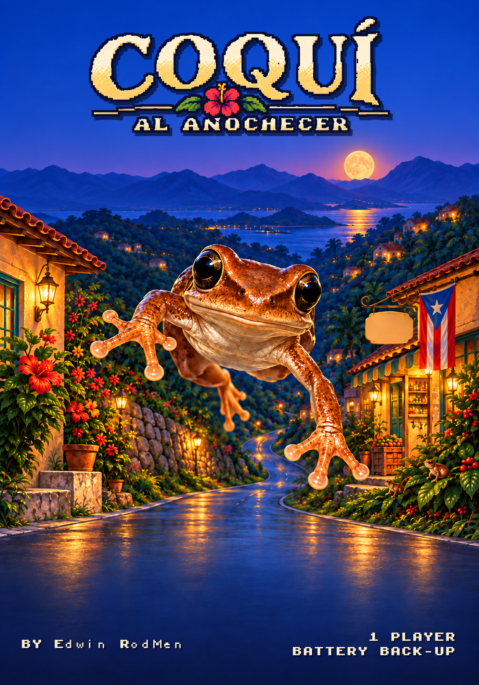
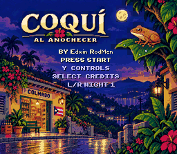
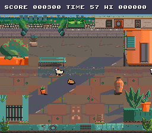
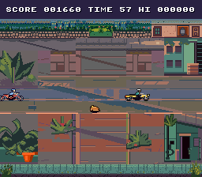
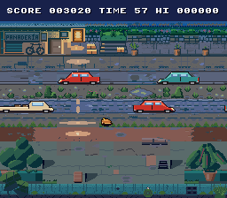
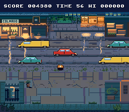
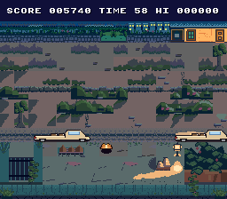
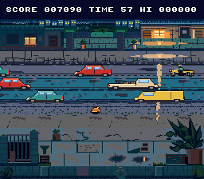
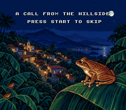

# Coquí al Anochecer

A homebrew game for the Super Nintendo Entertainment System, by
**Edwin RodMen**.



You are a coquí, the little brown tree frog whose two-note call fills every
Puerto Rican night, and it is dusk in a mountain barrio. Six screens stand
between you and the leaf where the chorus is gathering: a patio, a footpath, a
country road, the colmado, a coffee finca and the road band at the bottom of
the hill. Hop across each one, from the bottom of the screen to the perch at
the top, without meeting a hen, a moped or a delivery van on the way.

**Written in assembly.** The game itself, every routine the author wrote,
is 65C816 assembly language, the Super NES CPU's own instruction set,
written by hand rather than compiled, the way the cartridges of 1994 were
made. The author's two earlier Super NES games were written in C; this one
is assembly by choice. (The cartridge also carries PVSnesLib's small
runtime and its SNESMod sound driver, which runs on the SPC700 sound CPU;
see `THIRD_PARTY_NOTICES.txt`.)

|  |  |
|---|---|
|  |  |
|  |  |
|  |  |
|  |  |

*The title, the six screens of one night in the order you cross them, and the
ending.*

## Play it

Download `coqui-al-anochecer.sfc` and load it as an ordinary headerless NTSC
Super NES ROM. It is a 512 KB LoROM cartridge with 2 KB of battery-backed save
RAM and no enhancement chip. The configurations it has actually been tested
on are listed under **Verification status** below.

Every button is in the table below, and the game's own **Controls** page
(press **Y** on the title) says the same thing.

## Playing in Delta on iPhone or iPad

1. Save `coqui-al-anochecer.sfc` into the Files app — iCloud Drive, On My
   iPhone, anywhere Delta can reach.
2. In Delta, add a game and pick that file. The exact menu wording moves around
   between Delta and iOS versions; there is nothing to patch, and no companion
   file or external game data to supply.
3. Tap the cover to play.

Your reached nights, records and **HI** are a battery save, not a save state:
the cartridge writes them itself, so they survive closing the app without you
having to remember anything.

Delta's on-screen pad works, and this game only ever needs one press at a
time. A Bluetooth controller is nicer for the shoulder buttons that pick a
night.

## Controls

| Input | Action |
|---|---|
| **D-pad** | Hop one cell in that direction. One hop per press, no diagonals; holding a direction does not repeat |
| **B** | Call. Only while you are standing still on a safe cell. It changes nothing but the mood |
| **Start** | Start from the title; pause and resume; continue from the results |
| **L / R** | On the title: choose the night to play, among the nights you have reached |
| **Y** | On the title: the Controls page. On the results: this night's run stats |
| **Select** | On the title: the credits |
| **A** | On the results, after a completed night: go straight on to the next night |
| **X** | On the results: replay the night you just finished |

**A hop is a commitment.** The coquí lands where it was aimed, eight frames
later, and a press made during a hop is remembered and taken at the landing.
The newest press wins.

**Failure costs time, not lives.** Meeting a hazard puts you back at the start
of the screen. There is no life counter and no game over: you can retry a screen
as often as you like. The only thing you lose is seconds off the bonus clock,
which keeps running while you pick yourself up.

## A night

One night is the six screens in order — **El Patio**, **La Vereda**, **La
Carreterita**, **El Colmado**, **El Cafetal** and **El Coro** — each with its own
hazards, lanes and hour of the evening. The perch at the top of each screen
ends it; the last one opens the **ending**, a call from the hillside, the
coquí's answer and the whole barrio joining in.

**SCORE** is per night. Each screen has a 60-second bonus clock: clear it and
every second left is worth 10. Clearing a screen is worth 500 on its own. One
**insect** hides off the direct route on every screen, worth 300 if you go and
get it, and the results remember whether you found all six. Six digits,
leading zeros, exactly as it would have looked in 1994.

**Nights 1 to 3** are the standard game. Finishing Night 3 unlocks the optional
**Master Nights 4, 5 and 6**: the same six screens with harder traffic and new
detours, and no Night 7 after them. The results screen shows this run's
insect and collision counts, and for each of the six nights the cartridge
remembers the best score, whether a run cleared it with all six insects, and
the best collision-free time.

**HI**, the reached nights and the six night records live in battery-backed
SRAM, so they survive being switched off. A blank or damaged save simply
starts you at Night 1 with empty records.

## Sound

The call, every cue and every instrument in the music are synthesised from
arithmetic by the game's own tools. Nothing is sampled from anything. The
music follows the evening down: each screen's hour has its own colour and its
own arrangement, and the ending's chorus is the game's own fiction, not a
recording of a real coquí.

## Verify your download

```sh
shasum -a 256 -c SHA256SUMS.txt
```

Run it from inside this folder. Every file should report `OK`.

## What is in this package

| File | |
|---|---|
| `coqui-al-anochecer.sfc` | The game. 512 KB, NTSC, LoROM, 2 KB battery SRAM |
| `coqui-al-anochecer-box-front.png` | Box front artwork, 1400×2000 |
| `media/` | Screenshots, captured from this exact ROM in Mesen |
| `SHA256SUMS.txt` | Checksums for everything above |
| `LICENSE` | CC BY-NC-ND 4.0, in full |
| `PERMISSIONS.md` | Extra permissions the author grants on top of it |
| `NOTICE.md` | Authorship, provenance, and non-affiliation |
| `THIRD_PARTY_NOTICES.txt` | PVSnesLib and SNESMod attribution |

There are no other builds. Anything you find elsewhere with `proving`,
`autotest`, `audioqa` or `guardproof` in its name is a development diagnostic
and is not this game.

## Verification status

This ROM passes the project's automated gates, which run the exact file in
this package headless in **Mesen 2.1.1**: header and checksum, the
initialisation table, screen data and route fairness, on-screen text decoded
from video memory, palette and contrast contracts read back out of CGRAM,
sprite-table integrity read back out of OAM, a complete pad-driven crossing of
all six screens on every one of the six nights, the ending, the battery-save
load, save and corrupt-save fallback, the sound-bank structure, HDMA timing
and a frame-pacing budget.

Tested by the author, by playing, on this exact ROM: an **SNES Classic
Mini** (installed with hakchi, running the console's built-in emulator),
from the title through all six nights with the three Master Nights included
and the battery save intact; **ares v148** on a Mac, all six screens; and
**Delta** on iOS, all six screens. Earlier builds were played through in
ares with an Xbox controller and, with the battery save, in Delta. Nothing is
claimed for original Super NES hardware or flash cartridges: neither has
been tried.

No known defects. Three were found and fixed before release, all in the
bundled sound driver and none in the game's own code: the stock driver could
miss its own key-off about one pause in sixteen and leave notes ringing
through the pause, and on the SNES Classic's built-in emulator every sound
effect after the first fell silent and chords in the music lost notes,
because of how the stock driver wrote two of the sound chip's registers.
This ROM carries three small patches to that driver (see `NOTICE.md` and
`THIRD_PARTY_NOTICES.txt`), verified over repeated pause trials, by the
Mesen gates, and by the play-through on the SNES Classic. Reports of
anything else are welcome in the repository's issues.

## Licence

Released under
**[CC BY-NC-ND 4.0](https://creativecommons.org/licenses/by-nc-nd/4.0/)** —
keep it, play it, share the whole package for free with credit. Do not sell it,
and do not publish a modified version.

**Free does not mean unowned.** Selling this game — as a download, on a
cartridge, on a preloaded console or SD card, or inside a paid bundle — is not
permitted, and neither is putting it behind a paywall.

**Read `PERMISSIONS.md` before assuming something is banned.** Getting the ROM
onto your own console or emulator by whatever patching or repacking that takes,
sharing the package for free, and streaming or monetising *video* of the game
are all explicitly allowed.

Full terms in `LICENSE`. Authorship and provenance in `NOTICE.md` — including
which parts of this game are and are not the author's own work, stated plainly.

## Notices

An independent, unofficial homebrew project. Not affiliated with, endorsed by,
or associated with Nintendo. "Super Nintendo Entertainment System", "Super NES"
and "SNES" are Nintendo's marks and are used only to identify the hardware this
game runs on.

Written in 65C816 assembly, with the font, sprites, screens, music and sound
generated by the project's own Python tools. Built with
[PVSnesLib](https://github.com/alekmaul/pvsneslib), whose bundled sound
driver carries three marked patches from this project; see
`THIRD_PARTY_NOTICES.txt`.

---

**Edwin RodMen** — <https://github.com/VibezZzCoder/coqui-snes> —
[@edwin_rodmen](https://www.instagram.com/edwin_rodmen/)
